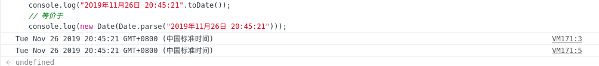

# 工具类

## String 扩展

扩展函数 `format` ;支持参数替换或者对象替换：

   ````javascript
   // 以下均输出： 1:测试|19
   
   // 对象替换
   document.writeln("{id}:{name}|{age}".format({
       id:"1",
       name:"测试",
       age:19,
   }));

   // 参数替换
   document.writeln("{0}:{1}|{3}".format("1","测试",19));
   ````
   
扩展函数 `toDate` ;时间格式字符串转换为时间格式：

   ````javascript
   // 以下均输出： Tue Nov 26 2019 20:45:21 GMT+0800 (中国标准时间)
   console.log("2019年11月26日 20:45:21".toDate());
   // 等价于
   console.log(new Date(Date.parse("2019年11月26日 20:45:21")));
   ````
   

   
## Date 扩展

扩展函数 `format` ;序列化时间：

   ````javascript
   // 当前时间： 2019年02月26日 20:45:21
   
   // 输出： 2019年02月26日 20:45:21
   document.writeln(new Date().format("yyyy年MM月dd日 hh:mm:ss"));

   // 输出： 2019年11月26日 20:45:21
   //       序列化的同时进行计算
   document.writeln(new Date().format("yyyy+1年MM-3月dd-1日 hh:mm:ss"));
   ````
   
优化函数 `Date.parse` ;支持更多格式
   
   ````javascript
   // 当前时间： 2019年02月26日 20:45:21
   
   // 输出： 2019年11月26日 20:45:21
   document.writeln(new Date(
       Date.parse("2019年11月26日 20:45:21")
   ).format("yyyy年MM月dd日 hh:mm:ss"));
   ````